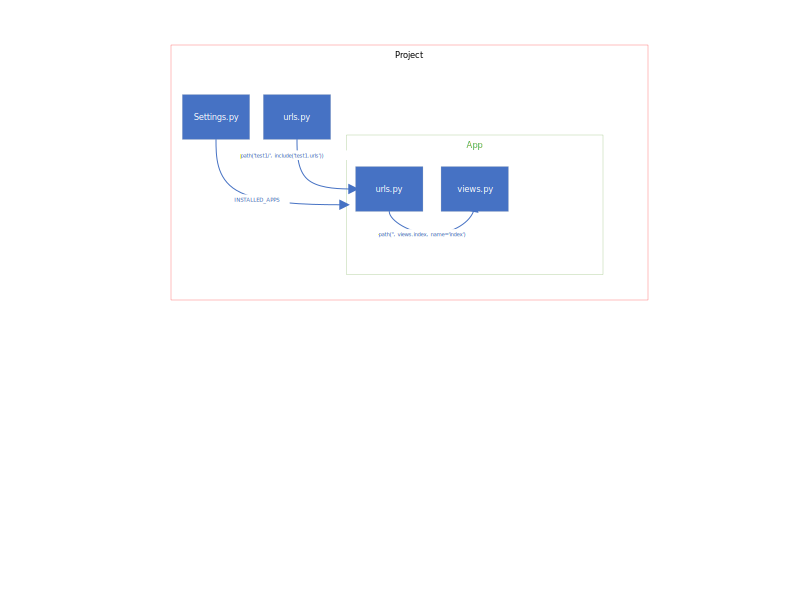

# Install Django
```python
python -m pip install Django
```

# Create your first Django Project
```python
django-admin startproject mysite
```

## Directory Structure
```
mysite/ -->Root Directory, can be any name, we got this name while creating project
    manage.py -->
    mysite/ --> This Directory contains the actual Python Package
        __init__.py --> This tells Python that the folder is a Python Package
        settings.py
        urls.py
        asgi.py
        wsgi.py
```

## Start Django Server (You have to be in directory where manage.py is. 8111 in the command is port number)
```python
 python manage.py runserver 8111
```

## Create new App, Poll, in the python project
```python
python manage.py startapp polls
```

## Create Database Table (Database info in Settings.py, look for 'DATABASES = {')
```python
python manage.py migrate
```

## Create Superuser Admin User
```python
python manage.py createsuperuser
```

## Login to Admin (Go to the below URL in your browser)
```python
http://127.0.0.1:8111/admin/
```

## How components are linked in Python




# Some Commands and code reference

## How to load an HTML (The template should be in templates folder of your app)
```python
def index(request):
    template = loader.get_template('test1/index.html')
    context = {
        'Bla': 'BLA BLA BLA LIST',
    }
    output = 'BLA BLA'
    return HttpResponse(template.render(context, request))
```

## Another way to load an HTML Template

```python
from django.shortcuts import render

def index(request):
    latest_question_list = Question.objects.order_by('-pub_date')[:5]
    context = {'Bla': 'BLA BLA BLA'}
    return render(request, 'test1/index.html', context)
```

## Way to add CSS (Should be added under static folder in the app). 
```
Note: You should restart the server for static files to load. Once a static file is loaded and change in CSS will not need restart
```

```python


<link rel="stylesheet" type="text/css" href="">
```


# Work with Models (Models are used mainly for databases)


## Create Database table
```
python manage.py makemigrations test1
```